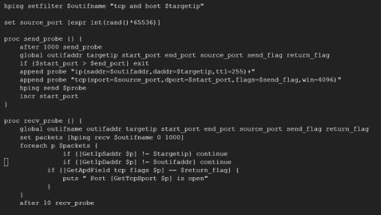
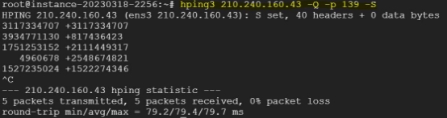

# 駭客攻防技術作業三：hping 

## 資工三乙 10911240 楊大為 

目標選擇：

本次偵查目標節點為台東大學演算法實驗室的網站主機，透過 nslookup、ping 我們可以得知其 IP 位置為 210.240.160.43。 

TCP SYN Scan： 

最簡單啟用經典 TCP SYN 掃描的方法是使用"-S"參數： 

注：使用參數"-c 1"限制只發送一次 SYN 封包，否則 hping 會繼續發送探測封包 這將會產生以下結果：

這將掃描 210.240.160.43 的 80 端口。從返回的輸出封包中，我們可以看到 SYN 和 ACK 的 flag 已設置（flags=SA），這表示該端口是開放的。

為了從 50 端口開始掃描一系列端口，我們使用以下指令：

注："++"前綴將使每個後續發送到目標的封包增加端口號。

產生以下結果：

從上面的輸出中，我們可以看到大部分的探測都返回 RST 封包，這表示所有這 些端口都是關閉的。只有針對 80、139 端口的探測封包返回 SYN ACK（在 50- 148 端口中），因此暗示著這些端口是開放的。

雖然這種掃描方法對於小範圍的端口偵測來說是可接受的，但是查看成千上萬 個端口掃描回應是很困難的。解決這個問題的最簡單方法是使用 grep 只顯示有 SYN ACK 的回應： 

然而，我們就會發現以這種方式使用 hping 是很麻煩的。因此 hping 提供了新的 掃描功能，可以使用"-8"或"—scan"參數來達到掃描的需求： 

使用"-8"或"—scan"參數標誌，我們有更靈活的方法來指定端口。例如，我們可 以使用逗號分隔的值 50–56,80，特殊關鍵詞 known 和 all，甚至可以使用否定運 算 50,56,!known。至於上面的掃描，它產生了以下輸出：

由上圖所示，如果掃描到的封包回應中包含 SYN ACK 旗標，那麼對應的端口 就是開啟的。然而，如果一個端口沒有回應封包，並不一定代表該端口沒有任 何服務在運行。這種情況可能是由於防火牆的設定將該端口設置為無回應模 式，或者該端口是一個 UDP 端口，不會對 TCP SYN 封包做出回應。

雖然 hping 的掃描模式非常方便，但它會產生一些用於資訊收集而非簡單端口 發現的封包。以下是對端口 53、80 的封包追蹤結果：

自從  hping3  推出後，除了命令列功能外，還引進了基於  Tcl  的強大腳本撰寫 功能。你可以輸入  hping3  指令進入互動模式，不必加上其他選項。接著會出 現以下提示：

輸入以下命令在的 80 端口上啟動簡單的 SYN 掃描： 

在上面的範例中，我們使用  Ars Packet Description (APD)  格式指定了完整的 TCP  封 包 （ ip 標 頭 設 定 ( 本 地 IP:  10.0.0.106,  目 標 IP:  210.240.160.43, TTL=255)+TCP 標頭設定(來源端口: 666,  目標端口: 80,  旗幟: syn)）。但我們並沒

有指定每個  IP  和  TCP  選項，因為  hping  能夠自動填充這些資訊。不過，以下 是一個完整指定的  APD  封包範例：

注：但是 APD 格式並無 tcp.timestamp()關鍵字，所以系統會報錯，解決方法就是 把最後的 tcp.timestamp 刪掉。 

要掃描多個端口，必須實現一個簡單的 Tcl 循環： 

上述命令將掃描 210.240.160.43 上的端口 79-81。將其實現為獨立的 Tcl 腳本以 供未來使用是很有意義的：

注：原作者不知道腦袋在想甚麼把  ==  打成  =====  了，修改完成後把 /usr/share/doc/hping3/examples/hpingstdlib.htcl  檔案與上述的腳本檔案放在同一 個資料夾路徑中即可正常使用。

上面的腳本建立了自定義的掃描開發方式。我們可以使用以下指令執行： 

輸出以下結果：

我們可以發現結果如預期中的相同，80 port 為開啟的情況。

TCP ACK Scan： 

TCP ACK 掃描可通過在探測封包中設置 ACK 旗標來執行：

也可以用互動模式達成：

也可以用在前一節中的 tcpscan.htcl 用以下命令執行 ACK Scan： 

注：當使用 ACK 掃描時，210.240.160.43 應該會對所有未知端口發送重置信號 (RST)，但因為此行為可能被防火牆限制住，因此 ACK 掃描失敗，不會收到 任何回傳封包。 

掃描成功的案例應該會如下所示：

注：上兩張圖都能夠收到回應的 RST 封包。 

注：腳本會把有回傳 RST 封包的端點視為開放端點。 

Other TCP Scans 

正如之前討論的掃描類型一樣，我們可以使用 hping3 中可用的不同標誌構建其 他常見的和自定義的類型。

對於 TCP 掃描，可以使用以下參數：

| -S or — syn flags=s SYN|
|-A or — ack flags=a ACK |
|-R or — rst flags=r RST |
|-F or — fin flags=f FIN |
|-P or — push flags=p PUSH |
|-U or — urg flags=u URG |
|-X or — xmas flags=x Xmas |
|-Y or — ymas flags=y Tmas |

有了上表，我們就可以輕鬆創建 XMas Scan: 

或是使用互動模式： 

可以發現 210.240.160.43 沒有回應我們任何封包，這邊提供一個有回應封包的 例子，目標端回應了一個 RST, ACK 封包： 

要執行  Null Scan，只需在發送的探測中省略所有目標 IP 前的參數： 

根據實驗，我們發現對於 IP 地址為 210.240.160.43 的主機，使用 TCP SYN 掃 描的成功率較高，而其他 TCP 掃描類型則較難獲得有用的資訊。在進行網路掃 描時，TCP SYN 掃描是常用的一種掃描方式，因為它可以在不與目標主機建立

完整 TCP 連接的情況下，傳送 SYN 封包並觀察返回的 ACK 或 RST 封包，從 而得知目標主機的狀態。儘管其他 TCP 掃描類型也有其應用場景，但它們的成 功率相對較低，需要更長的掃描時間和更多的資源，因此在實際應用中需要根 據不同的情況和目的選擇合適的掃描方式。

UDP Scans 

hping 可以透過在命令行中指定"-2"來配置為 UDP 模式。以下是經典的 UDP 端 口 Unreachable 掃描範例：

使用互動模式：

UDP Unreachable scan（UDP  不可達掃描）用於確定目標主機上的 UDP 端口是 否處於打開狀態。不像 TCP 那樣使用 SYN, ACK 握手來建立連接。因此，當發 送到未打開的  UDP  端口的數據包時，目標主機會向發送方發送 ICMP Unreachable 封包，通知發送方該端口不可達。

因此，我們可以透過回復的 ICMP Unreachable 封包確認該端口沒有開啟的 UDP 服務。 

IP Scan 

我們可以使用 hping 在目標上執行 IP 掃描以列舉支援的協議。使用以下腳本執 行掃描：

執行： 

執行結果：

腳本傳送了 1-255 個 IP 協定請求封包給 210.240.160.43，以期望透過接收到的

ICMP 回應封包來識別目標主機上開放的端口。遺憾的是，這個範例沒有接收 到任何回應封包。

Host Discovery 

對於所有不同類型的主機發現機制，hping 在命令行上只有有限的設施可用於掃 描多個目標（當然，編寫腳本時沒有此限制）。為了掃描一系列 IP 地址，可以 使用"x"字元，hping 會將其替換為隨機數字。例如，以下命令將掃描整個 C 類 LAN 範圍：

注：有存在服務中機器的 IP 位置為：42, 43, 44, 48, 49 

可以從 tshark 中看到此指令會讓主機發送 ICMP Echo 給隨機的 210.240.160.x IP 位置，並藉由回傳的 ICMP Replay 封包確認該位置主機是否存在。

根據實驗結果，我們發現在 210.240.160.x 網段中有在服務的主機 IP 都落於 40- 50 中。但是，使用--rand-dest 參數來代替 x 的方法可能對分析數據來說不太有 效，主要是因為可能會重複掃描相同的 IP 位置。如果想要以順序進行 IP 掃 描，最好使用腳本來執行，這樣可以更靈活地控制 IP 的掃描順序。

ICMP Ping 

以下是進行 ICMP Ping 的指令與其執行結果：

如果要發送不同類型的 ICMP 探測，例如時間戳請求，可以使用以下指令：

監測的封包紀錄也確實有發送正確的 ICMP 類別：

有兩種常見的 ICMP 類型的縮寫：

- --icmp-ts  相當於  -C 13（時間戳請求）
- --icmp-addr  相當於  -C 17（地址掩碼請求） -C 17 的執行結果：

注：可以看到程式有正常的發送地址掩碼請求，只是目標主機沒有回應。 互動模式可以用於產生類似的結果：

注：由於該封包的 TTL 為 0，所以實際上這個封包發不到目標位置，自然就不

會有預期的回應封包

實際上 hping3 中帶有一個完整的基於 ICMP Echo 的 ICMP Ping 實現，位於 library 中：

我們將檔案複製到家目錄，並對目標 IP 執行，並擷取相關的封包傳輸紀錄：

根據實驗結果，我們可以得出結論，210.240.160.43  主機能夠正常回應  ICMP timestamp  和  echo  請求。這個結果對於網絡管理員來說非常有價值，因為它表 示這個主機正在運行並能夠正常與其他設備通訊。

TCP Ping 

可以使用標準的  TCP  旗誌（flags）來發送不同類型的  TCP Ping。例如，要發 送一個到  80  端口的  TCP SYN Ping，可以使用以下指令：

封包監測：

以下是  Xmas Ping  的範例指令與封包監測：

透過本實驗，我們可以得出結論。TCP Ping  的結果與之前使用  TCP Scan  所得 到的結果相同。這個結論顯示  TCP Ping  也可以作為一種有效的  TCP  掃描方 法。 

UDP Ping 

UDP Ping  可以使用以下指令建立：

以下腳本命令將產生類似的結果：

上述針對於 210.240.160.43:0 的 UDP 掃描方法都沒有收到回傳封包，為此我們 將目的地端口改為 80，即可以接收到目標端回傳的 Port Unreachable 的錯誤訊 息：

根據實驗結果，UDP Ping  需要選擇正確的端口進行掃描才能得到有用的資訊。 在我們的實驗中，使用  0  號端口進行請求時，由於很多防火牆、作業系統規則 會忽略並且不回應，所以我們無法得到有效的回應。因此，在掃描  UDP Ping 時選擇正確的端口非常重要。

OS Fingerprinting 

hping 提供了多種收集 ISN 並確定它們增量的方法。其中最簡單的方法是使用 - Q 或--seqnum：

封包擷取，可以看到該指令發出了對應 ISN 序號的 TCP SYN 封包：

也有一個強大的腳本可以生成 ISN 增量的頻譜圖：

從 Github 下載該腳本到 hping3 中使用： 

確定$DISPLAY 環境變數有運作正常 

依照腳本內的說明

輸入參數。

產生出相應的 ISN 頻譜圖：

ISN  增量的頻譜圖可以用來分析和探測網絡上的 TCP 會話。ISN（Initial Sequence Number，初始序列號）是一個隨機產生的 TCP 數字，它用於開始 TCP  會話並確定數據傳輸的順序。如果攻擊者能夠預測  TCP  會話中的  ISN， 就有可能利用這個信息來進行攻擊，例如窃取敏感數據或篡改數據流。

Sniffer 

使用 hping 的監聽模式，我們可以攔截並保存所有通過我們計算機的網絡介面 的流量。例如，要攔截所有包含 HTTP 簽名的流量，可以使用以下命令：

在瀏覽 210.240.160.43 時的輸出結果：

本指令將如預期一般擷取所有 ens3 的 HTTP 封包。 或用更精確的方式，攔截所有與 http:// algo.nttu.edu.tw 有關的 HTTP 封包：

實驗結果如同我們預期地偵測到了我們瀏覽 [http://algo.nttu.edu.tw/PI.html ](http://algo.nttu.edu.tw/PI.html)的資 料。 

更進階的流量資訊顯示需要使用  Tcl  語言。要顯示在線路上捕獲的所有流量：

hping3> while 1 {
set p [lindex [hping recv ens3] 0] puts "[hping getfield data str $p]"
} 

我們甚至可以展示類似於  tcpdump  的輸出： 

hping3> while 1 {

`     `set p [lindex [hping recv ens3] 0] 

`     `puts "[hping getfield ip saddr $p] -> [hping getfield ip daddr $p]" 
} 

注：由於在 210.240.156.142 中使用 ssh 連線至實驗機器，所以會抓到一大堆相 關的封包。

Backdoor 

進一步擴展 hping 的監聽功能，我們可以將接收到的封包通過管道傳輸到 /bin/sh，以創建一個簡單的後門（backdoor）：

現在可以通過製作目標主機的特定封包來使用後門，這些封包包含了一個標誌

- secret），其後跟著存儲在  /commands\_file/  中的可執行命令（例如  cal  命

令，必須添加分號以便  /bin/sh  執行）傳送至架好後門的目標主機（在此假設 210.240.156.142 已設定好後門）執行。

雖然命令行僅提供基本的後門功能，但我們可以通過編寫自己的後門腳本來改 進：

注：網路介面要記得改為正在使用的網路介面卡名稱

現在在本機機器上運行了後門，我們可以在遠程機器上執行，在這邊我們使用 兩台 Kali Linux 虛擬機來展示：

由上述實驗結果我們可以發現在 10.0.2.15 中建立的後門藉由傳送包含關鍵字 secret 後續接指令的 TCP RST 封包，其腳本會將指令執行結果放置回傳的 TCP RST 封包中的 Payload 中。 

File Transfer 

我們可以使用  hping  傳輸完整的檔案，而非傳輸單獨的指令。以下是設置接收 端的方法：

hping3 -1  傳送端  -9 signature -I eth0 

發送端傳送檔案方法：

hping3 -1  接收端  -e signature -E /etc/passwd -d 2000 

注：使用  -d  標誌設置適當的文件大小，hping  將自動分段傳送。無法使用“-- safe”標誌傳輸文件。

檔案傳輸結果：

封包擷取結果：

藉由實驗我們可以發現發送端會將檔案包在 ICMP 的 Payload 區段傳給接收 端。 

Covert Channel 

透過製作幾乎任何 IP 封包的能力，我們可以建立一個隱蔽的通訊頻道，只使用 類似 ASCII 的 8 位元 IP 協定 ID。這個腳本將被分成接收和發送兩個部分。

使用上述腳本，實際訊息會被轉換為數值 ASCII 等效形式，因此您無法立即看 到訊息。但是，您會看到來自收驚下機器的大量 ICMP 協議不可達訊息和明文 傳輸的“redflag”訊息。以下是隱蔽通道的接收部分：

以下為執行結果，傳送方（右邊）傳送了”iAmDavid”訊息：

封包擷取中我們可以看到，每個封包的 IP protocal 即代表了一個 ASCII 字元：

Flooding 

以下是一個對 210.240.160.43 的經典 SYN Flood 攻擊範例：

藉由封包監測，我們可以看到該指令會向目標 IP 不斷發送大量的 SYN 封包， 但不完成最後一個 ACK 封包，目標為佔用目標系統的資源，導致其無法正常 處理其他合法的連線請求：

使用以下範例可以輕易地構造出一個 LAND 攻擊：

藉由封包檢測，該指令利用 TCP/IP 協議中的漏洞，將攻擊者的電腦 IP 地址和 目標系統的 IP 地址設置為相同，然後將攻擊對象的端口號作為源端口和目的端 口，從而使目標系統被迫處理自己發送的封包，導致系統資源被耗盡，無法正 常處理其他合法的連線請求：

使用虛擬機模擬也可以發現該封包確實有送到目的端達到攻擊效果：

上述攻擊的一個變體是遠端 LAND攻擊，由於路由器的預設內網 IP為 192.168.1.1， 我們嘗試以這個特性攻擊學校的路由器（210.240.149.9）： 

傳送封包擷取結果：

藉由封包擷取結果我們可以發現該指令使用 192.168.1.1 作為源 IP 地址，將攻 擊流量偽裝成內部設備的流量，這樣可以繞過路由器的安全檢測。此外，我們 還使用了-k 選項，使數據包重複發送，從而加劇攻擊效果，目標為導致其系統 崩潰或癱瘓。

Fuzzing 

可以使用以下命令模擬基本的 UDP traceroute： 

從結果我們可以看到在封包在經過了 15 個 hop 後到達目的 IP，其中的 IP 位置 都標示在圖中。

同樣地，可以使用以下指令來啟動 TCP traceroute：

從結果我們可以看到在封包一樣在經過了 15 個 hop 後到達目的 IP，其中的 IP 位置都標示在圖中，但看起來有一些路由器有附載平衡機制，所以路徑不會完 全一致。 

注：如果 hping 在任何一個跳躍點卡住了，只需按下 CTRL-Z 即可跳過無回應 的跳點。 

為了觀察路由在不同跳躍點上的變化，我們可以固定 TTL 值。例如，當 ping algo.nttu.edu.tw 時，我們可以看到路由在第 15 個跳躍點上的變化：

可以在輸出結果中看到第 15 跳介於 210.240.149.102 或 192.192.61.177，會導致 此種情形可能是路由路徑的不同。

Firewall/IDS Testing 

許多防火牆都包括一個規則，即丟棄未設置  TCP  時戳選項的  TCP  封包，而這 在眾多的端口掃描中很常見。只需添加  --tcp-timestamp  選項以附加時間戳信息 即可：

如同預期ㄧ般，TCP SYN ACK 封包被加上的了時戳。

Local Privilege Escalation 

可以從 hping3>命令提示符執行任何 shell 命令。如果 hping3>以 root 權限運 行，則所有 shell 命令都將以 root 權限運行：

在結果中可以看到，以不同的使用者權限執行 hping3，其在互動模式中下的 shell  指令權限皆會對應到執行 hping3 指令當下的使用者權限。這個功能讓我 們可以更加靈活地操作 hping3。 

結論 

總結來說，hping 是一個非常有用的網路掃描工具，它提供了各種強大的功能， 如發送各種不同的封包、偵測遠端服務系統的開放端口、測試網絡和故障排除 等等。此外，hping 還具有一些進階功能，如檔案傳輸、後門和攻擊功能等，這 些功能可以幫助資安和測試人員更深入地瞭解和測試網絡安全性，也可以作為 駭客攻擊工具。 

然而，使用 hping 進行網絡掃描時，需要特別注意其合法性和合規性，避免違 反相關的法律規範。在使用 hping 時，應該遵守相關的道德準則和法律限制， 並僅限於合法和授權的目的。
